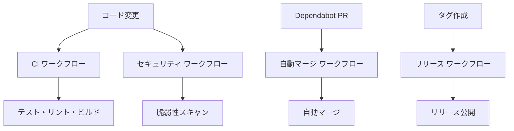

# GitHub Actions ワークフロー説明書

このドキュメントでは、`.github/workflows/` ディレクトリに含まれる各GitHub Actionsワークフローの用途と機能について説明します。

## 概要

このプロジェクトでは、以下の4つのワークフローが設定されています：

1. **CI (継続的インテグレーション)** - `ci.yml`
2. **Dependabot自動マージ** - `dependabot-auto-merge.yml`
3. **リリース** - `release.yml`
4. **セキュリティ** - `security.yml`

---

## 1. CI ワークフロー (`ci.yml`)

### 用途
コードの品質を保証するための継続的インテグレーション（CI）パイプラインです。

### トリガー条件
- `main` または `master` ブランチへのプッシュ
- `main` または `master` ブランチへのプルリクエスト

### 実行内容

#### テストジョブ (`test`)
- **実行環境**: Ubuntu Latest
- **Go バージョン**: 1.23
- **実行内容**:
  - 依存関係のキャッシュ
  - 依存関係のインストール
  - 単体テスト実行
  - レース条件検出テスト実行
  - カバレッジ測定
  - Codecovへのカバレッジアップロード

#### リントジョブ (`lint`)
- **実行環境**: Ubuntu Latest
- **Go バージョン**: 1.23
- **実行内容**:
  - golangci-lintによるコード品質チェック

#### ビルドジョブ (`build`)
- **実行環境**: Ubuntu Latest
- **依存関係**: test, lintジョブの成功
- **実行内容**:
  - アプリケーションのビルド
  - バージョンコマンドのテスト
  - マルチプラットフォーム向けビルド
  - ビルド成果物のアップロード

---

## 2. Dependabot自動マージワークフロー (`dependabot-auto-merge.yml`)

### 用途
Dependabotが作成した依存関係更新のプルリクエストを自動的にマージします。

### トリガー条件
- プルリクエストの作成、同期、再オープン時

### 実行内容
- **実行条件**: GitHubアクターがDependabotの場合のみ
- **自動マージ対象**: パッチ版およびマイナー版の更新のみ
- **権限**: contents:write, pull-requests:write

### セキュリティ考慮事項
- メジャーバージョンアップデートは手動レビューが必要
- パッチとマイナーアップデートのみ自動マージ

---

## 3. リリースワークフロー (`release.yml`)

### 用途
バージョンタグが作成された際に、自動的にリリースを作成・公開します。

### トリガー条件
- `v*` パターンのタグがプッシュされた時（例: v1.0.0, v2.1.3）

### 実行内容
- **実行環境**: Ubuntu Latest
- **Go バージョン**: 1.24
- **使用ツール**: GoReleaser
- **権限**: contents:write

### 機能
- マルチプラットフォーム向けバイナリの自動生成
- GitHub Releasesへの自動公開
- リリースノートの自動生成

---

## 4. セキュリティワークフロー (`security.yml`)

### 用途
コードベースのセキュリティ脆弱性を検出・監視します。

### トリガー条件
- `main` または `master` ブランチへのプッシュ
- `main` または `master` ブランチへのプルリクエスト
- 毎日午前2時（UTC）にスケジュール実行

### 実行内容

#### 1. govulncheck ジョブ
- **用途**: Go言語の既知の脆弱性をチェック
- **ツール**: golang.org/x/vuln/cmd/govulncheck

#### 2. nancy ジョブ
- **用途**: 依存関係の脆弱性スキャン
- **ツール**: Sonatype Nancy
- **機能**: go.modファイルの依存関係を分析

#### 3. gosec ジョブ
- **用途**: Goコードの静的セキュリティ分析
- **ツール**: securego/gosec
- **出力**: SARIF形式のレポート
- **連携**: GitHub Security機能との統合

#### 4. CodeQL ジョブ
- **用途**: 高度な静的コード分析
- **ツール**: GitHub CodeQL
- **言語**: Go
- **権限**: actions:read, contents:read, security-events:write
- **機能**: セキュリティ脆弱性とコード品質の問題を検出

---

## ワークフロー間の関係

## 推奨事項

1. **CI ワークフロー**: 全てのプルリクエストでテストが通ることを確認
2. **セキュリティ ワークフロー**: 定期的にセキュリティレポートを確認
3. **Dependabot**: メジャーバージョンアップデートは手動でレビュー
4. **リリース**: セマンティックバージョニングに従ったタグ作成

## 設定ファイルの場所

- CI設定: `.github/workflows/ci.yml`
- Dependabot設定: `.github/workflows/dependabot-auto-merge.yml`
- リリース設定: `.github/workflows/release.yml`
- セキュリティ設定: `.github/workflows/security.yml`
- GoReleaser設定: `.goreleaser.yaml`

---

*最終更新: 2025年12月9日*
